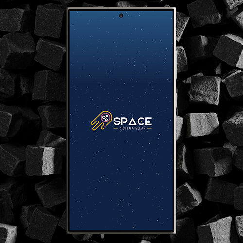
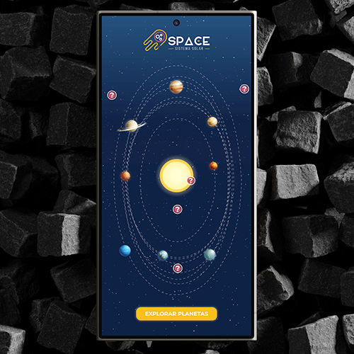
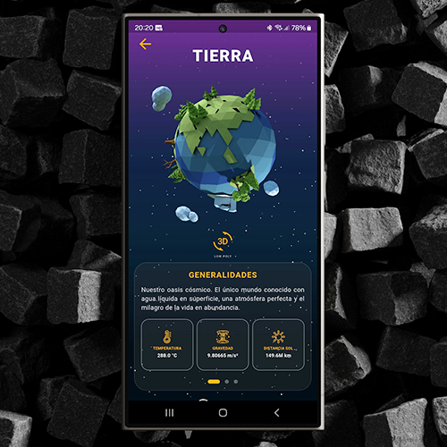

# 🚀 Space Solar System App

¡Bienvenido a **Space Solar System**, una experiencia interactiva e inmersiva del universo desarrollada en Flutter! Esta aplicación combina animaciones avanzadas, renderizado 3D interactivo y consumo de datos astronómicos en tiempo real para ofrecer un viaje educativo y visualmente premium a través de nuestro sistema solar.

---

## 📸 Capturas de Pantalla

| Splash Screen | Home Screen (Órbitas) | Detalle del Planeta (3D) |
| :---: | :---: | :---: |
|  |  |  |

---

## ✨ Características Destacadas

* 🌌 **Fondo Estelar Dinámico (Efecto Twinkle):** Diseñado a nivel de GPU utilizando un `CustomPainter` y optimizado con `AnimatedBuilder`. Las más de 200 estrellas titilan con un desfase matemático basado en la función `sin()`, logrando un cielo natural y de alto rendimiento.
* 🪐 **Simulación de Órbitas Elípticas:** Pantalla principal interactiva donde los planetas giran alrededor del Sol siguiendo trayectorias elípticas realistas calculadas matemáticamente en un entorno de capas `Stack`.
* ☀️ **Animaciones Fluidas con Lottie:** Integración de micro-animaciones dinámicas de alta calidad (como el brillo del sol) mediante archivos JSON exportados desde After Effects.
* 📦 **Modelado e Interactividad 3D Real:** En la pantalla de detalles se integran los planetas modelados en formato Low Poly desde Blender usando la librería `flutter_cube`. ¡El usuario puede rotar y explorar los cuerpos celestes en 3D con total transparencia sobre el fondo galáctico!
* 📡 **Consumo de API REST con Dio:** Conexión directa con la API pública *The Solar System OpenData* para extraer información precisa (gravedad, temperatura, lunas, perihelio y afelio) estructurada en un modelo sólido de datos.
* 🗺️ **Arquitectura de Navegación con GoRouter:** Rutas declarativas y limpias que facilitan el paso de parámetros estructurados entre la lista principal y la vista detallada.
* 📐 **Diseño 100% Adaptativo (Responsive):** Clases de utilidad personalizadas mediante extensiones de Dart que adaptan tamaños, paddings y márgenes proporcionales en cualquier dispositivo (desde pantallas compactas hasta terminales de gama alta como el S22 Ultra).

---

## 🛠️ Tecnologías y Paquetes Utilizados

* **Flutter & Dart** (SDK Actualizado)
* [**Dio**](https://pub.dev/packages/dio) - Cliente HTTP robusto para el consumo de la API REST.
* [**GoRouter**](https://pub.dev/packages/go_router) - Gestión y estructuración declarativa de rutas.
* [**Flutter Cube**](https://pub.dev/packages/flutter_cube) - Renderizado e interacción táctil con archivos 3D (`.obj` / `.mtl`).
* [**Lottie**](https://pub.dev/packages/lottie) - Renderizado de animaciones vectoriales de After Effects.
* [**Flutter SVG**](https://pub.dev/packages/flutter_svg) - Visualización limpia y escalable del logotipo vectorial optimizado con SVGOMG.

---

## 📁 Arquitectura del Proyecto (Vistas Principales)

* `SplashScreen`: Inicio inmersivo con degradados profundos, estrellas centelleantes y carga asíncrona del logo corporativo.
* `HomeScreen`: El núcleo orbital interactivo donde puedes visualizar el sistema en movimiento y acceder al listado general de astros.
* `PlanetList`: Grid adaptativo centrado horizontalmente que despliega las tarjetas y resúmenes profesionales de cada planeta.
* `DetailPlanet`: Panel translúcido de ciencia ficción (vidrio esmerilado) que fusiona la información técnica de la API con el visualizador interactivo 3D.

---

## 🚀 Instalación y Configuración

Sigue estos pasos para clonar y ejecutar el universo en tu máquina local:

1.  **Clonar el repositorio:**
    ```bash
    git clone [https://github.com/CarlosSaltos26/Space-Solar-System-App.git](https://github.com/CarlosSaltos26/Space-Solar-System-App.git)
    ```

2.  **Entrar al directorio del proyecto:**
    ```bash
    cd Space-Solar-System-App
    ```

3.  **Instalar las dependencias de Flutter:**
    ```bash
    flutter pub get
    ```

4.  **Asegurar los Assets:**
    Comprueba que posees las texturas equirrectangulares, los modelos `.obj` de Blender y los iconos de la app en tu ruta local definida en el archivo `pubspec.yaml`.

5.  **Ejecutar la aplicación:**
    ```bash
    flutter run
    ```

---

## 🌌 Créditos y Feedback

Desarrollado con mucha pasión por **Carlos** 🚀. 
Agradecimiento especial a la API *The Solar System OpenData* por proveer los recursos espaciales. ¡Si te gusta este viaje interestelar, no dudes en dejar una ⭐ en el repositorio!